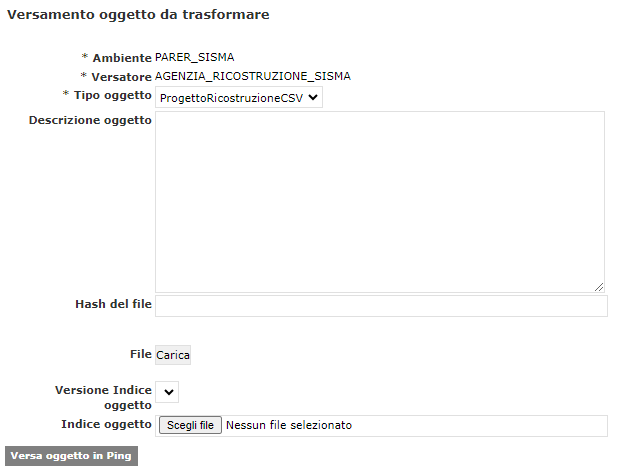

# PING (PreINGest) 

Fonte template redazione documento:  https://www.makeareadme.com/.


# Descrizione

Il modulo software PING (PreINGest) gestisce il processo di preacquisizione nel caso di versamento di Oggetti da trasformare in SIP. 


# Installazione

Requisiti minimi per installazione: 

- Sistema operativo : consigliato Linux server (in alternativa compatibilità con Windows server);
- Java versione 11 (OpenJDK / Oracle);
- JBoss 7 EAP;
- Oracle DB (versione consigliata 19c).

## Installazione JDK 

Consigliata adozione della OpenJDK alla versione 8, guida all'installazione https://openjdk.org/install/.

## Setup application server (Jboss 7)

Richiesta l'esecuzione delle seguenti guide secondo l'ordine riportato di seguito: 

1. guida per la configurazione **base** di [guida 1](src/docs/JBoss7_configurazione_generale.md);
2. guida con le configurazioni **specifiche** per il contesto applicativo **SIAM**  di [guida 2](src/docs/JBoss7_configurazione_siam.md).


### Deploy su JBoss 7

Di seguito le indicazioni per il rilascio su application server JBoss7: 

1. generazione dell'artifact attraverso tool maven, eseguire il seguente comando: 

   ```bash
   mvn package
   ```
   
2. viene generato l'artifact .ear all'interno del modulo preingest-ear/target (e.g. sacerping-4.22.0.ear)
3. deploy dell'ear generato allo step 1 su JBoss 7 (vedi configurazione [setup JBoss7](#setup-application-server-jboss-7))


## Predisposizione database

L'applicazione utilizza come DBMS di riferimento Oracle DB (https://www.oracle.com/it/database/) alla versione, consigliata, **19c**. Per l'installazione e la configurazione fare riferimento alle guide ufficiali.

Per la creazione del modello E-R consultare il seguente [README.md](https://github.com/RegioneER/parer-db-init/blob/master/README.md) (progetto di riferimento https://github.com/RegioneER/parer-db-init).

## Configurazione bucket S3 Object Storage

L'applicazione può essere integrata sulla base delle configurazioni impostate, vedi paragrafo Setup application server (Jboss 7), ad uno storage grid o object storage attraverso lo standard AWS S3.

### Configurazione dei bucket

Una possibile configurazione dei bucket proposta è la seguente, tra parentesi il nome del parametro da configurare su PING:

- xformer : Nome del bucket per archiviare i report delle trasformazioni richieste a Kettle Server (BUCKET_REPORT_XFORMER).
- sisma-trasformati : Nome del bucket per i progetti Sisma da trasformare (BUCKET_SISMA_TRASFORMATI).
- su-trasformati : Nome del bucket per gli Strumenti Urbanistici da trasformare (BUCKET_STRUMENTI_URBANISTICI_TRASFORMATI).
- sisma-verifica : Nome del bucket per la verifica dei progetti Sisma (BUCKET_VERIFICA_SISMA).
- su-verifica : Nome del bucket per la verifica degli Strumenti Urbanistici (BUCKET_VERIFICA_STRUMENTI_URBANISTICI).
- xf-object : Nome del bucket usato per versare oggetti se il tipo oggetto lo specifica (BUCKET_VERSAMENTO_OGGETTO).

# Utilizzo

La trasmissione dei pacchetti, solitamente compressi, avviene tramite avviene tramite interfaccia utente  o protocollo FTPS; l’FTP server provvede a memorizzare i file ricevuti sullo storage dedicato allo spazio FTP di input. 

Una volta ricevuti gli Oggetti, un job schedulato provvede alla loro elaborazione per la produzione dei SIP da versare. Un ulteriore job schedulato si occupa di effettuare il versamento a SacER, che avviene utilizzando un apposito servizio di versamento. Tale servizio accetta in chiamata due file XML, uno con l’Indice del SIP e un altro con le Informazioni sull’impacchettamento, relative alla posizione dei file del SIP memorizzati sullo spazio FTP di input. 

SacER utilizza le Informazioni sull’impacchettamento per recuperare i file dal file system di PING e depositarli nel proprio per le successive elaborazioni. 

Le successive elaborazioni vengono eseguite da PING direttamente, nel caso in cui la normalizzazione possa basarsi su regole precodificate (come p.e. nel caso delle immagini diagnostiche in formato Dicom), oppure utilizzando un motore ETL di esecuzione delle trasformazioni nel caso in cui si debbano applicare regole di trasformazioni specifiche dell’oggetto in questione. In questo caso le regole vengono definite durante la fase di avvio del servizio, tramite uno strumento visuale ed eventuali integrazioni di codice sviluppato ad hoc. 

PING traccia e memorizza nel proprio Data Base gli esiti dei versamenti a SacER e può essere interrogato da un operatore tramite interfaccia web o dal sistema versante tramite opportuno Web Service, per conoscere a quale punto del processo è giunto il SIP. 

PING mette inoltre a disposizione del Produttore un client di versamento di Oggetti da trasformare, sia on line, sia tramite l’utilizzo di un client FTP installato sulla postazione di lavoro dell’utente o su un server della rete del Produttore. 


### Amministrazione Versatori

 

Il sistema gestisce l'anagrafe dei soggetti che possono versare gli oggetti, chiamati Versatori, questi possono essere di tipo: 

* PRODUTTORE
* SOGGETTO ATTUATORE 

I versatori di tipo PRODUTTORE sono collegati ad un ente convenzionato e hanno una struttura corrispondente in SACER. 

 

La configurazione del versatore prevede inoltre la possibilità di definire i tipi di oggetto gestiti. 

 


I Tipi oggetto possono essere di diverse categorie, distinguibili in due macrogruppi: 

* Oggetti che contengono dati grezzi che devono essere trasformati in SIP di UD per essere versati a SACER
  * DA TRASFORMARE – da trasformare con kettle-server
  * NO ZIP – da trasformare con PING 
* Oggetti che contengono uno o più SIP di UD da versare a SACER
  * ZIP NO XML SACER – da trasformare con PING (non utilizzato)
  * ZIP CON XML SACER – generato da trasformazione 

La configurazione di un tipo oggetto consente di definire alcune caratteristiche dello stesso, i controlli a cui deve essere sottoposto in fase di versamento, la priorità di tratttamento. 

 


### Versamenti

Il sistema offre delle interfacce utente per la gestione del versamento degli oggetti. 

 

È possibile scegliere il tipo oggetto da versare e indicare il path FTP nel quale si trova o eventualmente caricare direttamente il file ZIP dell'oggetto. 

 

Il sistema offre anche delle funzioni di ricerca degli oggetti versati 

 

 

### Monitoraggio

 

La sezione monitoraggio consente all'utente di monitorare l'andamento del processo di versamento in tutte le sue fasi. 

 

### Gestione trasformazioni

 

Contiene l'anagrafe delle trasformazioni gestite dal sistema e un cruscotto di monitoraggio delle trasformazioni eseguite. 

 

 

# Librerie utilizzate

|  GroupId | ArtifactId  | Version |
|:---:|:---:|:---:|
|none|||
|antlr|antlr|2.7.7.redhat-7|
|com.fasterxml.jackson.core|jackson-annotations|2.12.7.redhat-00003|
|com.fasterxml.jackson.core|jackson-core|2.12.7.redhat-00003|
|com.fasterxml.jackson.core|jackson-databind|2.12.7.redhat-00003|
|com.fasterxml.woodstox|woodstox-core|6.4.0.redhat-00001|
|com.fasterxml|classmate|1.5.1.redhat-00001|
|com.io7m.xom|xom|1.2.10|
|com.narupley|not-going-to-be-commons-ssl|0.3.20|
|com.sun.activation|jakarta.activation|1.2.2.redhat-00002|
|com.sun.istack|istack-commons-runtime|3.0.10.redhat-00001|
|com.sun.mail|jakarta.mail|1.6.7.redhat-00003|
|com.zaxxer|SparseBitSet|1.3|
|commons-beanutils|commons-beanutils|1.9.4|
|commons-codec|commons-codec|1.17.1|
|commons-fileupload|commons-fileupload|1.5|
|commons-io|commons-io|2.16.1|
|commons-logging|commons-logging|1.3.3|
|commons-net|commons-net|3.9.0|
|it.eng.parer|spagofat-core|6.15.0|
|it.eng.parer|spagofat-middle|6.15.0|
|it.eng.parer|spagofat-paginator-ejb|6.15.0|
|it.eng.parer|spagofat-paginator-gf|6.15.0|
|it.eng.parer|spagofat-sl-jpa|6.15.0|
|it.eng.parer|spagofat-timer-wrapper-common|6.15.0|
|jakarta.activation|jakarta.activation-api|2.1.2|
|jakarta.enterprise|jakarta.enterprise.cdi-api|2.0.2.redhat-00002|
|jakarta.inject|jakarta.inject-api|1.0.3.redhat-00001|
|jakarta.json.bind|jakarta.json.bind-api|1.0.2.redhat-00001|
|jakarta.json|jakarta.json-api|1.1.6.redhat-00001|
|jakarta.persistence|jakarta.persistence-api|2.2.3.redhat-00001|
|jakarta.security.enterprise|jakarta.security.enterprise-api|1.0.2.redhat-00001|
|jakarta.validation|jakarta.validation-api|2.0.2.redhat-00001|
|jakarta.xml.bind|jakarta.xml.bind-api|2.3.2|
|javax.activation|javax.activation-api|1.2.0|
|javax.annotation|javax.annotation-api|1.3.2|
|javax.jws|jsr181-api|1.0.0.MR1-redhat-8|
|javax.persistence|javax.persistence-api|2.2|
|javax.validation|validation-api|2.0.1.Final|
|javax.xml.bind|jaxb-api|2.3.0|
|javax.xml.soap|javax.xml.soap-api|1.4.0|
|javax.xml.ws|jaxws-api|2.3.1|
|joda-time|joda-time|2.12.5|
|junit|junit|4.13.2|
|net.bytebuddy|byte-buddy|1.11.12.redhat-00002|
|org.apache-extras.beanshell|bsh|2.0b6|
|org.apache.commons|commons-collections4|4.5.0-M2|
|org.apache.commons|commons-lang3|3.15.0|
|org.apache.commons|commons-math3|3.6.1|
|org.apache.commons|commons-text|1.12.0|
|org.apache.httpcomponents|httpclient|4.5.14|
|org.apache.httpcomponents|httpcore|4.4.16|
|org.apache.logging.log4j|log4j-api|2.23.1|
|org.apache.poi|poi|5.3.0|
|org.apache.santuario|xmlsec|4.0.2|
|org.apache.taglibs|taglibs-standard-impl|1.2.6.RC1-redhat-1|
|org.apache.taglibs|taglibs-standard-spec|1.2.6.RC1-redhat-1|
|org.apache.velocity|velocity-engine-core|2.3|
|org.apache.xmlbeans|xmlbeans|5.1.1|
|org.bouncycastle|bcpkix-jdk18on|1.77|
|org.bouncycastle|bcprov-jdk18on|1.77|
|org.bouncycastle|bcutil-jdk18on|1.77|
|org.codehaus.jettison|jettison|1.5.4|
|org.codehaus.woodstox|stax2-api|4.2.1.redhat-00001|
|org.dom4j|dom4j|2.1.4|
|org.eclipse.microprofile.openapi|microprofile-openapi-api|3.1.1|
|org.eclipse.persistence|org.eclipse.persistence.antlr|2.3.2|
|org.eclipse.persistence|org.eclipse.persistence.asm|2.3.2|
|org.eclipse.persistence|org.eclipse.persistence.core|2.3.2|
|org.eclipse.persistence|org.eclipse.persistence.moxy|2.3.2|
|org.glassfish.jaxb|jaxb-runtime|2.3.3.b02-redhat-00002|
|org.glassfish.jaxb|txw2|2.3.3.b02-redhat-00002|
|org.hamcrest|hamcrest-core|1.3|
|org.hibernate.common|hibernate-commons-annotations|5.0.5.Final-redhat-00002|
|org.hibernate.validator|hibernate-validator|6.0.22.Final-redhat-00002|
|org.hibernate|hibernate-core|5.3.20.Final-redhat-00001|
|org.hibernate|hibernate-entitymanager|5.3.20.Final-redhat-00001|
|org.hibernate|hibernate-jpamodelgen|5.6.14.Final-redhat-00001|
|org.javassist|javassist|3.27.0.GA-redhat-00001|
|org.jboss.logging|jboss-logging|3.1.0.GA|
|org.jboss.spec.javax.annotation|jboss-annotations-api_1.3_spec|2.0.1.Final-redhat-00001|
|org.jboss.spec.javax.batch|jboss-batch-api_1.0_spec|2.0.0.Final-redhat-00001|
|org.jboss.spec.javax.ejb|jboss-ejb-api_3.2_spec|2.0.0.Final-redhat-00001|
|org.jboss.spec.javax.el|jboss-el-api_3.0_spec|2.0.1.Final-redhat-00001|
|org.jboss.spec.javax.enterprise.concurrent|jboss-concurrency-api_1.0_spec|2.0.0.Final-redhat-00001|
|org.jboss.spec.javax.faces|jboss-jsf-api_2.3_spec|3.0.0.SP08-redhat-00001|
|org.jboss.spec.javax.interceptor|jboss-interceptors-api_1.2_spec|2.0.0.Final-redhat-00002|
|org.jboss.spec.javax.jms|jboss-jms-api_2.0_spec|2.0.0.Final-redhat-00001|
|org.jboss.spec.javax.management.j2ee|jboss-j2eemgmt-api_1.1_spec|2.0.0.Final-redhat-00001|
|org.jboss.spec.javax.resource|jboss-connector-api_1.7_spec|2.0.0.Final-redhat-00001|
|org.jboss.spec.javax.security.auth.message|jboss-jaspi-api_1.1_spec|2.0.1.Final-redhat-00001|
|org.jboss.spec.javax.security.jacc|jboss-jacc-api_1.5_spec|2.0.0.Final-redhat-00001|
|org.jboss.spec.javax.servlet.jsp|jboss-jsp-api_2.3_spec|2.0.1.Final-redhat-00001|
|org.jboss.spec.javax.servlet|jboss-servlet-api_4.0_spec|2.0.0.Final-redhat-00001|
|org.jboss.spec.javax.transaction|jboss-transaction-api_1.2_spec|1.1.1.Final|
|org.jboss.spec.javax.transaction|jboss-transaction-api_1.3_spec|2.0.0.Final-redhat-00005|
|org.jboss.spec.javax.websocket|jboss-websocket-api_1.1_spec|2.0.0.Final-redhat-00001|
|org.jboss.spec.javax.ws.rs|jboss-jaxrs-api_2.1_spec|2.0.1.Final-redhat-00001|
|org.jboss.spec.javax.xml.bind|jboss-jaxb-api_2.3_spec|2.0.1.Final-redhat-00001|
|org.jboss.spec.javax.xml.soap|jboss-saaj-api_1.4_spec|1.0.2.Final-redhat-00002|
|org.jboss.spec.javax.xml.ws|jboss-jaxws-api_2.3_spec|2.0.0.Final-redhat-00001|
|org.jboss.spec|jboss-jakartaee-8.0|1.0.1.Final-redhat-00008|
|org.jboss|jandex|2.4.4.Final-redhat-00001|
|org.jboss|jboss-vfs|3.1.0.Final|
|org.keycloak|keycloak-adapter-core|24.0.5|
|org.keycloak|keycloak-adapter-spi|24.0.5|
|org.keycloak|keycloak-authz-client|24.0.5|
|org.keycloak|keycloak-common|24.0.5|
|org.keycloak|keycloak-core|24.0.5|
|org.keycloak|keycloak-crypto-default|24.0.5|
|org.keycloak|keycloak-policy-enforcer|24.0.5|
|org.keycloak|keycloak-server-spi-private|24.0.5|
|org.keycloak|keycloak-server-spi|24.0.5|
|org.keycloak|keycloak-servlet-adapter-spi|24.0.5|
|org.keycloak|keycloak-servlet-filter-adapter|24.0.5|
|org.opensaml|opensaml|2.6.6|
|org.opensaml|openws|1.5.6|
|org.opensaml|xmltooling|1.4.6|
|org.owasp.esapi|esapi|2.2.0.0|
|org.slf4j|slf4j-api|2.0.13|
|org.springframework.security.extensions|spring-security-saml2-core|1.0.10.RELEASE|
|org.springframework.security|spring-security-config|5.8.13|
|org.springframework.security|spring-security-core|5.8.13|
|org.springframework.security|spring-security-crypto|5.8.13|
|org.springframework.security|spring-security-web|5.8.13|
|org.springframework|spring-aop|5.3.39|
|org.springframework|spring-beans|5.3.39|
|org.springframework|spring-context|5.3.39|
|org.springframework|spring-core|5.3.39|
|org.springframework|spring-expression|5.3.39|
|org.springframework|spring-jcl|5.3.39|
|org.springframework|spring-web|5.3.39|
|org.springframework|spring-webmvc|5.3.39|
|xml-apis|xml-apis|1.4.01|
|com.fasterxml.jackson.core|jackson-annotations|2.12.7.redhat-00003|
|com.fasterxml.jackson.core|jackson-core|2.12.7.redhat-00003|
|com.fasterxml.jackson.core|jackson-databind|2.12.7.redhat-00003|
|com.fasterxml.woodstox|woodstox-core|6.4.0.redhat-00001|
|com.io7m.xom|xom|1.2.10|
|com.narupley|not-going-to-be-commons-ssl|0.3.20|
|com.sun.activation|jakarta.activation|1.2.2.redhat-00002|
|com.sun.istack|istack-commons-runtime|3.0.10.redhat-00001|
|com.sun.mail|jakarta.mail|1.6.7.redhat-00003|
|com.zaxxer|SparseBitSet|1.3|
|commons-beanutils|commons-beanutils|1.9.4|
|commons-codec|commons-codec|1.17.1|
|commons-fileupload|commons-fileupload|1.5|
|commons-io|commons-io|2.16.1|
|commons-logging|commons-logging|1.3.3|
|commons-net|commons-net|3.9.0|
|it.eng.parer|sacerping-jboss-jpa|6.1.1-SNAPSHOT|
|it.eng.parer|spagofat-core|6.15.0|
|it.eng.parer|spagofat-middle|6.15.0|
|it.eng.parer|spagofat-paginator-ejb|6.15.0|
|it.eng.parer|spagofat-paginator-gf|6.15.0|
|it.eng.parer|spagofat-sl-jpa|6.15.0|
|jakarta.activation|jakarta.activation-api|2.1.2|
|jakarta.enterprise|jakarta.enterprise.cdi-api|2.0.2.redhat-00002|
|jakarta.inject|jakarta.inject-api|1.0.3.redhat-00001|
|jakarta.json.bind|jakarta.json.bind-api|1.0.2.redhat-00001|
|jakarta.json|jakarta.json-api|1.1.6.redhat-00001|
|jakarta.persistence|jakarta.persistence-api|2.2.3.redhat-00001|
|jakarta.security.enterprise|jakarta.security.enterprise-api|1.0.2.redhat-00001|
|jakarta.validation|jakarta.validation-api|2.0.2.redhat-00001|
|jakarta.xml.bind|jakarta.xml.bind-api|2.3.2|
|javax.annotation|javax.annotation-api|1.3.2|
|javax.jws|jsr181-api|1.0.0.MR1-redhat-8|
|javax.xml.bind|jaxb-api|2.3.0|
|javax.xml.soap|javax.xml.soap-api|1.4.0|
|javax.xml.ws|jaxws-api|2.3.1|
|joda-time|joda-time|2.12.5|
|junit|junit|4.13.2|
|org.apache-extras.beanshell|bsh|2.0b6|
|org.apache.commons|commons-collections4|4.5.0-M2|
|org.apache.commons|commons-lang3|3.15.0|
|org.apache.commons|commons-math3|3.6.1|
|org.apache.commons|commons-text|1.12.0|
|org.apache.httpcomponents|httpclient|4.5.14|
|org.apache.httpcomponents|httpcore|4.4.16|
|org.apache.logging.log4j|log4j-api|2.18.0|
|org.apache.logging.log4j|log4j-core|2.18.0|
|org.apache.poi|poi|5.3.0|
|org.apache.santuario|xmlsec|4.0.2|
|org.apache.taglibs|taglibs-standard-impl|1.2.6.RC1-redhat-1|
|org.apache.taglibs|taglibs-standard-spec|1.2.6.RC1-redhat-1|
|org.apache.velocity|velocity-engine-core|2.3|
|org.apache.xmlbeans|xmlbeans|5.1.1|
|org.bouncycastle|bcpkix-jdk18on|1.77|
|org.bouncycastle|bcprov-jdk18on|1.77|
|org.bouncycastle|bcutil-jdk18on|1.77|
|org.codehaus.jettison|jettison|1.5.4|
|org.codehaus.woodstox|stax2-api|4.2.1.redhat-00001|
|org.dom4j|dom4j|2.1.4|
|org.eclipse.microprofile.openapi|microprofile-openapi-api|3.1.1|
|org.eclipse.persistence|org.eclipse.persistence.antlr|2.3.2|
|org.eclipse.persistence|org.eclipse.persistence.asm|2.3.2|
|org.eclipse.persistence|org.eclipse.persistence.core|2.3.2|
|org.eclipse.persistence|org.eclipse.persistence.moxy|2.3.2|
|org.glassfish.jaxb|jaxb-runtime|2.3.3.b02-redhat-00002|
|org.glassfish.jaxb|txw2|2.3.3.b02-redhat-00002|
|org.hamcrest|hamcrest-core|1.3|
|org.hibernate|hibernate-jpamodelgen|5.6.14.Final-redhat-00001|
|org.jboss.logging|jboss-logging|3.4.1.Final-redhat-00001|
|org.jboss.spec.javax.annotation|jboss-annotations-api_1.3_spec|2.0.1.Final-redhat-00001|
|org.jboss.spec.javax.batch|jboss-batch-api_1.0_spec|2.0.0.Final-redhat-00001|
|org.jboss.spec.javax.ejb|jboss-ejb-api_3.2_spec|2.0.0.Final-redhat-00001|
|org.jboss.spec.javax.el|jboss-el-api_3.0_spec|2.0.1.Final-redhat-00001|
|org.jboss.spec.javax.enterprise.concurrent|jboss-concurrency-api_1.0_spec|2.0.0.Final-redhat-00001|
|org.jboss.spec.javax.faces|jboss-jsf-api_2.3_spec|3.0.0.SP08-redhat-00001|
|org.jboss.spec.javax.interceptor|jboss-interceptors-api_1.2_spec|2.0.0.Final-redhat-00002|
|org.jboss.spec.javax.jms|jboss-jms-api_2.0_spec|2.0.0.Final-redhat-00001|
|org.jboss.spec.javax.management.j2ee|jboss-j2eemgmt-api_1.1_spec|2.0.0.Final-redhat-00001|
|org.jboss.spec.javax.resource|jboss-connector-api_1.7_spec|2.0.0.Final-redhat-00001|
|org.jboss.spec.javax.security.auth.message|jboss-jaspi-api_1.1_spec|2.0.1.Final-redhat-00001|
|org.jboss.spec.javax.security.jacc|jboss-jacc-api_1.5_spec|2.0.0.Final-redhat-00001|
|org.jboss.spec.javax.servlet.jsp|jboss-jsp-api_2.3_spec|2.0.1.Final-redhat-00001|
|org.jboss.spec.javax.servlet|jboss-servlet-api_4.0_spec|2.0.0.Final-redhat-00001|
|org.jboss.spec.javax.transaction|jboss-transaction-api_1.3_spec|2.0.0.Final-redhat-00005|
|org.jboss.spec.javax.websocket|jboss-websocket-api_1.1_spec|2.0.0.Final-redhat-00001|
|org.jboss.spec.javax.ws.rs|jboss-jaxrs-api_2.1_spec|2.0.1.Final-redhat-00001|
|org.jboss.spec.javax.xml.bind|jboss-jaxb-api_2.3_spec|2.0.1.Final-redhat-00001|
|org.jboss.spec.javax.xml.soap|jboss-saaj-api_1.4_spec|1.0.2.Final-redhat-00002|
|org.jboss.spec.javax.xml.ws|jboss-jaxws-api_2.3_spec|2.0.0.Final-redhat-00001|
|org.jboss.spec|jboss-jakartaee-8.0|1.0.1.Final-redhat-00008|
|org.keycloak|keycloak-adapter-core|24.0.5|
|org.keycloak|keycloak-adapter-spi|24.0.5|
|org.keycloak|keycloak-authz-client|24.0.5|
|org.keycloak|keycloak-common|24.0.5|
|org.keycloak|keycloak-core|24.0.5|
|org.keycloak|keycloak-crypto-default|24.0.5|
|org.keycloak|keycloak-policy-enforcer|24.0.5|
|org.keycloak|keycloak-server-spi-private|24.0.5|
|org.keycloak|keycloak-server-spi|24.0.5|
|org.keycloak|keycloak-servlet-adapter-spi|24.0.5|
|org.keycloak|keycloak-servlet-filter-adapter|24.0.5|
|org.opensaml|opensaml|2.6.6|
|org.opensaml|openws|1.5.6|
|org.opensaml|xmltooling|1.4.6|
|org.owasp.esapi|esapi|2.2.0.0|
|org.slf4j|slf4j-api|2.0.13|
|org.springframework.security.extensions|spring-security-saml2-core|1.0.10.RELEASE|
|org.springframework.security|spring-security-config|5.8.13|
|org.springframework.security|spring-security-core|5.8.13|
|org.springframework.security|spring-security-crypto|5.8.13|
|org.springframework.security|spring-security-web|5.8.13|
|org.springframework|spring-aop|5.3.39|
|org.springframework|spring-beans|5.3.37|
|org.springframework|spring-context|5.3.39|
|org.springframework|spring-core|5.3.39|
|org.springframework|spring-expression|5.3.39|
|org.springframework|spring-jcl|5.3.39|
|org.springframework|spring-web|5.3.39|
|org.springframework|spring-webmvc|5.3.39|
|xml-apis|xml-apis|1.4.01|
|com.fasterxml.jackson.core|jackson-annotations|2.12.7.redhat-00003|
|com.fasterxml.jackson.core|jackson-core|2.12.7.redhat-00003|
|com.fasterxml.jackson.core|jackson-databind|2.12.7.redhat-00003|
|com.fasterxml.woodstox|woodstox-core|6.4.0.redhat-00001|
|com.github.relaxng|relaxngDatatype|2011.1.0.redhat-9|
|com.io7m.xom|xom|1.2.10|
|com.narupley|not-going-to-be-commons-ssl|0.3.20|
|com.sun.activation|jakarta.activation|1.2.2.redhat-00002|
|com.sun.activation|javax.activation|1.2.0|
|com.sun.codemodel|codemodel|2.6.0.redhat-3|
|com.sun.istack|istack-commons-runtime|2.6.1.redhat-3|
|com.sun.istack|istack-commons-tools|2.6.1.redhat-3|
|com.sun.mail|jakarta.mail|1.6.7.redhat-00003|
|com.sun.org.apache.xml.internal|resolver|20050927|
|com.sun.xml.bind|jaxb-core|2.3.0|
|com.sun.xml.bind|jaxb-impl|2.2.5.redhat-9|
|com.sun.xml.bind|jaxb-jxc|2.3.0|
|com.sun.xml.bind|jaxb-xjc|2.2.5.redhat-9|
|com.sun.xml.fastinfoset|FastInfoset|1.2.18|
|com.sun.xml.messaging.saaj|saaj-impl|1.3.16.SP1-redhat-2|
|com.sun.xml.stream.buffer|streambuffer|1.5.10|
|com.sun.xml.txw2|txw2|20110809.0.0.redhat-5|
|com.sun.xml.ws|jaxws-eclipselink-plugin|2.3.0|
|com.sun.xml.ws|jaxws-ri|2.3.0|
|com.sun.xml.ws|jaxws-rt|2.3.5|
|com.sun.xml.ws|jaxws-tools|2.3.0|
|com.sun.xml.ws|policy|2.7.10|
|com.sun.xml.ws|sdo-eclipselink-plugin|2.3.0|
|com.sun.xsom|xsom|20110809.0.0.redhat-4|
|com.zaxxer|SparseBitSet|1.3|
|commonj.sdo|commonj.sdo|2.1.1.v201112051852|
|commons-codec|commons-codec|1.17.1|
|commons-fileupload|commons-fileupload|1.5|
|commons-io|commons-io|2.16.1|
|commons-logging|commons-logging|1.3.3|
|commons-net|commons-net|3.9.0|
|io.netty|netty-buffer|4.1.108.Final|
|io.netty|netty-codec-http2|4.1.108.Final|
|io.netty|netty-codec-http|4.1.108.Final|
|io.netty|netty-codec|4.1.108.Final|
|io.netty|netty-common|4.1.108.Final|
|io.netty|netty-handler|4.1.108.Final|
|io.netty|netty-resolver|4.1.108.Final|
|io.netty|netty-transport-classes-epoll|4.1.108.Final|
|io.netty|netty-transport-native-unix-common|4.1.108.Final|
|io.netty|netty-transport|4.1.108.Final|
|it.eng.parer|idp-jaas-rdbms|0.0.9|
|it.eng.parer|parer-kettle-model|2.0.0|
|it.eng.parer|parer-kettle-soap-client|2.0.0|
|it.eng.parer|parer-test-suite|0.0.2|
|it.eng.parer|preingest-xml|3.1.0|
|it.eng.parer|sacer-xml|2.11.0|
|it.eng.parer|sacerping-jboss-jpa|6.1.1-SNAPSHOT|
|it.eng.parer|sacerping-jboss-slg|6.1.1-SNAPSHOT|
|it.eng.parer|spagofat-core|6.15.0|
|it.eng.parer|spagofat-middle|6.15.0|
|it.eng.parer|spagofat-paginator-ejb|6.15.0|
|it.eng.parer|spagofat-paginator-gf|6.15.0|
|it.eng.parer|spagofat-si-client|6.15.0|
|it.eng.parer|spagofat-si-server|classes|
|it.eng.parer|spagofat-si-util|6.15.0|
|it.eng.parer|spagofat-sl-ejb|6.15.0|
|it.eng.parer|spagofat-sl-jpa|6.15.0|
|it.eng.parer|spagofat-sl-slg|6.15.0|
|it.eng.parer|spagofat-timer-wrapper-common|6.15.0|
|it.eng.parer|spagofat-timer-wrapper-ejb|6.15.0|
|jakarta.activation|jakarta.activation-api|2.1.2|
|jakarta.annotation|jakarta.annotation-api|1.3.5|
|jakarta.enterprise|jakarta.enterprise.cdi-api|2.0.2.redhat-00002|
|jakarta.inject|jakarta.inject-api|1.0.3.redhat-00001|
|jakarta.json.bind|jakarta.json.bind-api|1.0.2.redhat-00001|
|jakarta.json|jakarta.json-api|1.1.6.redhat-00001|
|jakarta.jws|jakarta.jws-api|2.1.0|
|jakarta.persistence|jakarta.persistence-api|2.2.3.redhat-00001|
|jakarta.security.enterprise|jakarta.security.enterprise-api|1.0.2.redhat-00001|
|jakarta.validation|jakarta.validation-api|2.0.2.redhat-00001|
|jakarta.xml.bind|jakarta.xml.bind-api|2.3.3|
|jakarta.xml.soap|jakarta.xml.soap-api|1.4.2|
|jakarta.xml.ws|jakarta.xml.ws-api|2.3.3|
|javax.activation|activation|1.1.1.redhat-4|
|javax.annotation|javax.annotation-api|1.3.2|
|javax.inject|javax.inject|1.0.0.redhat-5|
|javax.jws|jsr181-api|1.0.0.MR1-redhat-7|
|javax.mail|mail|1.4.5.redhat-2|
|javax.validation|validation-api|1.0.0.GA-redhat-3|
|javax.xml.bind|jaxb-api|2.3.0|
|javax.xml.soap|javax.xml.soap-api|1.4.0|
|javax.xml.ws|jaxws-api|2.3.1|
|joda-time|joda-time|2.12.5|
|junit|junit|4.13.2|
|net.java.xadisk|xadisk|1.2.2.5|
|net.sourceforge.javacsv|javacsv|2.0|
|org.apache-extras.beanshell|bsh|2.0b6|
|org.apache.commons|commons-collections4|4.5.0-M2|
|org.apache.commons|commons-lang3|3.15.0|
|org.apache.commons|commons-math3|3.6.1|
|org.apache.commons|commons-text|1.12.0|
|org.apache.cxf|cxf-api|2.7.18.SP6-redhat-1|
|org.apache.cxf|cxf-core|3.3.9.redhat-00001|
|org.apache.cxf|cxf-rt-bindings-soap|3.3.9.redhat-00001|
|org.apache.cxf|cxf-rt-bindings-xml|3.3.9.redhat-00001|
|org.apache.cxf|cxf-rt-core|2.7.18.SP6-redhat-1|
|org.apache.cxf|cxf-rt-databinding-jaxb|2.7.14.redhat-1|
|org.apache.cxf|cxf-rt-frontend-jaxws|3.3.9.redhat-00001|
|org.apache.cxf|cxf-rt-frontend-simple|3.3.9.redhat-00001|
|org.apache.cxf|cxf-rt-transports-http|3.3.9.redhat-00001|
|org.apache.cxf|cxf-rt-ws-addr|3.3.9.redhat-00001|
|org.apache.cxf|cxf-rt-ws-policy|3.3.9.redhat-00001|
|org.apache.cxf|cxf-rt-wsdl|3.3.9.redhat-00001|
|org.apache.geronimo.specs|geronimo-javamail_1.4_spec|1.7.1|
|org.apache.httpcomponents|httpclient|4.5.14|
|org.apache.httpcomponents|httpcore|4.4.16|
|org.apache.httpcomponents|httpmime|4.5.14|
|org.apache.logging.log4j|log4j-api|2.18.0|
|org.apache.logging.log4j|log4j-core|2.18.0|
|org.apache.neethi|neethi|3.0.2.redhat-3|
|org.apache.poi|poi|5.3.0|
|org.apache.santuario|xmlsec|4.0.2|
|org.apache.taglibs|taglibs-standard-impl|1.2.6.RC1-redhat-1|
|org.apache.taglibs|taglibs-standard-spec|1.2.6.RC1-redhat-1|
|org.apache.velocity|velocity-engine-core|2.3|
|org.apache.ws.xmlschema|xmlschema-core|2.0.2.redhat-3|
|org.apache.xmlbeans|xmlbeans|5.1.1|
|org.bouncycastle|bcpkix-jdk18on|1.77|
|org.bouncycastle|bcprov-jdk18on|1.77|
|org.bouncycastle|bcutil-jdk18on|1.77|
|org.codehaus.jettison|jettison|1.5.4|
|org.codehaus.woodstox|stax2-api|3.1.3.redhat-1|
|org.codehaus.woodstox|woodstox-core-asl|4.2.0.redhat-4|
|org.dom4j|dom4j|2.1.4|
|org.eclipse.microprofile.openapi|microprofile-openapi-api|3.1.1|
|org.eclipse.persistence|commonj.sdo|2.1.1|
|org.eclipse.persistence|eclipselink|2.6.4|
|org.eclipse.persistence|javax.persistence|2.1.1|
|org.eclipse.persistence|org.eclipse.persistence.antlr|2.3.2|
|org.eclipse.persistence|org.eclipse.persistence.asm|2.3.2|
|org.eclipse.persistence|org.eclipse.persistence.core|2.3.2|
|org.eclipse.persistence|org.eclipse.persistence.moxy|2.3.2|
|org.glassfish.external|management-api|3.2.3|
|org.glassfish.gmbal|gmbal-api-only|4.0.3|
|org.glassfish.ha|ha-api|3.1.13|
|org.glassfish.jaxb|jaxb-runtime|2.3.3.b02-redhat-00002|
|org.glassfish.jaxb|txw2|2.3.3.b02-redhat-00002|
|org.glassfish|javax.json|1.0.4|
|org.hamcrest|hamcrest-core|1.3|
|org.hibernate|hibernate-jpamodelgen|5.6.14.Final-redhat-00001|
|org.hibernate|hibernate-validator|4.3.2.Final-redhat-2|
|org.jboss.arquillian.config|arquillian-config-api|1.4.0.Final|
|org.jboss.arquillian.config|arquillian-config-impl-base|1.4.0.Final|
|org.jboss.arquillian.config|arquillian-config-spi|1.4.0.Final|
|org.jboss.arquillian.container|arquillian-container-impl-base|1.4.0.Final|
|org.jboss.arquillian.container|arquillian-container-osgi|1.0.3.Final|
|org.jboss.arquillian.container|arquillian-container-spi|1.4.0.Final|
|org.jboss.arquillian.container|arquillian-container-test-api|1.4.0.Final|
|org.jboss.arquillian.container|arquillian-container-test-impl-base|1.4.0.Final|
|org.jboss.arquillian.container|arquillian-container-test-spi|1.4.0.Final|
|org.jboss.arquillian.core|arquillian-core-api|1.4.0.Final|
|org.jboss.arquillian.core|arquillian-core-impl-base|1.4.0.Final|
|org.jboss.arquillian.core|arquillian-core-spi|1.4.0.Final|
|org.jboss.arquillian.junit|arquillian-junit-container|1.4.0.Final|
|org.jboss.arquillian.junit|arquillian-junit-core|1.4.0.Final|
|org.jboss.arquillian.protocol|arquillian-protocol-jmx|1.4.0.Final|
|org.jboss.arquillian.protocol|arquillian-protocol-servlet|1.4.0.Final|
|org.jboss.arquillian.test|arquillian-test-api|1.4.0.Final|
|org.jboss.arquillian.test|arquillian-test-impl-base|1.4.0.Final|
|org.jboss.arquillian.test|arquillian-test-spi|1.4.0.Final|
|org.jboss.arquillian.testenricher|arquillian-testenricher-cdi|1.4.0.Final|
|org.jboss.arquillian.testenricher|arquillian-testenricher-ejb|1.4.0.Final|
|org.jboss.arquillian.testenricher|arquillian-testenricher-initialcontext|1.4.0.Final|
|org.jboss.arquillian.testenricher|arquillian-testenricher-osgi|1.0.3.Final|
|org.jboss.arquillian.testenricher|arquillian-testenricher-resource|1.4.0.Final|
|org.jboss.as|jboss-as-arquillian-common|7.5.0.Final-redhat-21|
|org.jboss.as|jboss-as-arquillian-container-managed|7.5.0.Final-redhat-21|
|org.jboss.as|jboss-as-arquillian-protocol-jmx|7.5.0.Final-redhat-21|
|org.jboss.as|jboss-as-arquillian-testenricher-msc|7.5.0.Final-redhat-21|
|org.jboss.as|jboss-as-build-config|7.5.0.Final-redhat-21|
|org.jboss.as|jboss-as-controller-client|7.5.0.Final-redhat-21|
|org.jboss.as|jboss-as-controller|7.5.0.Final-redhat-21|
|org.jboss.as|jboss-as-deployment-repository|7.5.0.Final-redhat-21|
|org.jboss.as|jboss-as-domain-http-interface|7.5.0.Final-redhat-21|
|org.jboss.as|jboss-as-domain-management|7.5.0.Final-redhat-21|
|org.jboss.as|jboss-as-ee|7.5.0.Final-redhat-21|
|org.jboss.as|jboss-as-jmx|7.5.0.Final-redhat-21|
|org.jboss.as|jboss-as-naming|7.5.0.Final-redhat-21|
|org.jboss.as|jboss-as-network|7.5.0.Final-redhat-21|
|org.jboss.as|jboss-as-osgi-service|7.5.0.Final-redhat-21|
|org.jboss.as|jboss-as-platform-mbean|7.5.0.Final-redhat-21|
|org.jboss.as|jboss-as-process-controller|7.5.0.Final-redhat-21|
|org.jboss.as|jboss-as-protocol|7.5.0.Final-redhat-21|
|org.jboss.as|jboss-as-remoting|7.5.0.Final-redhat-21|
|org.jboss.as|jboss-as-server|7.5.0.Final-redhat-21|
|org.jboss.as|jboss-as-version|7.5.0.Final-redhat-21|
|org.jboss.com.sun.httpserver|httpserver|1.0.4.Final-redhat-1|
|org.jboss.invocation|jboss-invocation|1.1.2.Final-redhat-1|
|org.jboss.logging|jboss-logging|3.1.4.GA-redhat-2|
|org.jboss.logmanager|jboss-logmanager|1.5.4.Final-redhat-1|
|org.jboss.marshalling|jboss-marshalling-river|1.4.10.Final-redhat-1|
|org.jboss.marshalling|jboss-marshalling|1.4.10.Final-redhat-1|
|org.jboss.metadata|jboss-metadata-common|7.2.1.Final-redhat-1|
|org.jboss.metadata|jboss-metadata-ear|7.2.1.Final-redhat-1|
|org.jboss.modules|jboss-modules|1.3.6.Final-redhat-1|
|org.jboss.msc|jboss-msc|1.1.5.Final-redhat-1|
|org.jboss.osgi.deployment|jbosgi-deployment|1.3.0.Final-redhat-2|
|org.jboss.osgi.framework|jbosgi-framework-core|2.1.0.Final-redhat-2|
|org.jboss.osgi.metadata|jbosgi-metadata|2.2.0.Final-redhat-2|
|org.jboss.osgi.repository|jbosgi-repository-api|2.1.0.Final-redhat-2|
|org.jboss.osgi.repository|jbosgi-repository-core|2.1.0.Final-redhat-2|
|org.jboss.osgi.resolver|jbosgi-resolver-api|3.0.1.Final-redhat-2|
|org.jboss.osgi.resolver|jbosgi-resolver-felix|3.0.1.Final-redhat-2|
|org.jboss.osgi.spi|jbosgi-spi|3.2.0.Final-redhat-2|
|org.jboss.osgi.vfs|jbosgi-vfs30|1.2.1.Final-redhat-4|
|org.jboss.osgi.vfs|jbosgi-vfs|1.2.1.Final-redhat-4|
|org.jboss.remoting3|jboss-remoting|3.3.4.Final-redhat-1|
|org.jboss.remotingjmx|remoting-jmx|1.1.3.Final-redhat-2|
|org.jboss.sasl|jboss-sasl|1.0.5.Final-redhat-1|
|org.jboss.shrinkwrap.descriptors|shrinkwrap-descriptors-api-base|2.0.0|
|org.jboss.shrinkwrap.descriptors|shrinkwrap-descriptors-spi|2.0.0|
|org.jboss.shrinkwrap|shrinkwrap-api|1.2.6|
|org.jboss.shrinkwrap|shrinkwrap-impl-base|1.2.6|
|org.jboss.shrinkwrap|shrinkwrap-spi|1.2.6|
|org.jboss.spec.javax.annotation|jboss-annotations-api_1.1_spec|1.0.1.Final-redhat-3|
|org.jboss.spec.javax.annotation|jboss-annotations-api_1.3_spec|2.0.1.Final-redhat-00001|
|org.jboss.spec.javax.batch|jboss-batch-api_1.0_spec|2.0.0.Final-redhat-00001|
|org.jboss.spec.javax.ejb|jboss-ejb-api_3.2_spec|2.0.0.Final-redhat-00001|
|org.jboss.spec.javax.el|jboss-el-api_3.0_spec|2.0.1.Final-redhat-00001|
|org.jboss.spec.javax.enterprise.concurrent|jboss-concurrency-api_1.0_spec|2.0.0.Final-redhat-00001|
|org.jboss.spec.javax.faces|jboss-jsf-api_2.3_spec|3.0.0.SP08-redhat-00001|
|org.jboss.spec.javax.interceptor|jboss-interceptors-api_1.1_spec|1.0.1.Final-redhat-3|
|org.jboss.spec.javax.interceptor|jboss-interceptors-api_1.2_spec|2.0.0.Final-redhat-00002|
|org.jboss.spec.javax.jms|jboss-jms-api_2.0_spec|2.0.0.Final-redhat-00001|
|org.jboss.spec.javax.management.j2ee|jboss-j2eemgmt-api_1.1_spec|1.0.1.Final-redhat-3|
|org.jboss.spec.javax.resource|jboss-connector-api_1.7_spec|2.0.0.Final-redhat-00001|
|org.jboss.spec.javax.security.auth.message|jboss-jaspi-api_1.1_spec|2.0.1.Final-redhat-00001|
|org.jboss.spec.javax.security.jacc|jboss-jacc-api_1.5_spec|2.0.0.Final-redhat-00001|
|org.jboss.spec.javax.servlet.jsp|jboss-jsp-api_2.3_spec|2.0.1.Final-redhat-00001|
|org.jboss.spec.javax.servlet|jboss-servlet-api_4.0_spec|2.0.0.Final-redhat-00001|
|org.jboss.spec.javax.transaction|jboss-transaction-api_1.1_spec|1.0.1.Final-redhat-3|
|org.jboss.spec.javax.transaction|jboss-transaction-api_1.3_spec|2.0.0.Final-redhat-00005|
|org.jboss.spec.javax.websocket|jboss-websocket-api_1.1_spec|2.0.0.Final-redhat-00001|
|org.jboss.spec.javax.ws.rs|jboss-jaxrs-api_2.1_spec|2.0.1.Final-redhat-00001|
|org.jboss.spec.javax.xml.bind|jboss-jaxb-api_2.2_spec|1.0.4.Final-redhat-3|
|org.jboss.spec.javax.xml.bind|jboss-jaxb-api_2.3_spec|2.0.1.Final-redhat-00001|
|org.jboss.spec.javax.xml.soap|jboss-saaj-api_1.4_spec|1.0.2.Final-redhat-00002|
|org.jboss.spec.javax.xml.ws|jboss-jaxws-api_2.3_spec|2.0.0.Final-redhat-00001|
|org.jboss.spec|jboss-jakartaee-8.0|1.0.1.Final-redhat-00008|
|org.jboss.stdio|jboss-stdio|1.0.2.GA-redhat-1|
|org.jboss.threads|jboss-threads|2.1.2.Final-redhat-1|
|org.jboss.xnio|xnio-api|3.0.13.GA-redhat-1|
|org.jboss.xnio|xnio-nio|3.0.13.GA-redhat-1|
|org.jboss|jandex|1.2.2.Final-redhat-1|
|org.jboss|jboss-common-core|2.2.17.GA-redhat-3|
|org.jboss|jboss-dmr|1.2.2.Final-redhat-1|
|org.jboss|jboss-ejb-client|1.0.30.Final-redhat-1|
|org.jboss|jboss-remote-naming|1.0.10.Final-redhat-1|
|org.jboss|jboss-vfs|3.2.9.Final-redhat-1|
|org.jboss|staxmapper|1.1.0.Final-redhat-3|
|org.jvnet.mimepull|mimepull|1.9.15|
|org.jvnet.staxex|stax-ex|1.8.3|
|org.keycloak|keycloak-adapter-core|24.0.5|
|org.keycloak|keycloak-adapter-spi|24.0.5|
|org.keycloak|keycloak-authz-client|24.0.5|
|org.keycloak|keycloak-common|24.0.5|
|org.keycloak|keycloak-core|24.0.5|
|org.keycloak|keycloak-crypto-default|24.0.5|
|org.keycloak|keycloak-policy-enforcer|24.0.5|
|org.keycloak|keycloak-server-spi-private|24.0.5|
|org.keycloak|keycloak-server-spi|24.0.5|
|org.keycloak|keycloak-servlet-adapter-spi|24.0.5|
|org.keycloak|keycloak-servlet-filter-adapter|24.0.5|
|org.osgi|org.osgi.core|4.2.0.redhat-8|
|org.ow2.asm|asm|9.0|
|org.owasp.esapi|esapi|2.2.0.0|
|org.picketbox|picketbox|4.1.1.Final-redhat-1|
|org.reactivestreams|reactive-streams|1.0.3.redhat-00003|
|org.slf4j|slf4j-api|2.0.13|
|org.springframework.security.extensions|spring-security-saml2-core|1.0.10.RELEASE|
|org.springframework.security|spring-security-config|5.8.13|
|org.springframework.security|spring-security-core|5.8.13|
|org.springframework.security|spring-security-crypto|5.8.13|
|org.springframework.security|spring-security-web|5.8.13|
|org.springframework|spring-aop|5.3.39|
|org.springframework|spring-beans|5.3.39|
|org.springframework|spring-context|5.3.39|
|org.springframework|spring-core|5.3.39|
|org.springframework|spring-expression|5.3.39|
|org.springframework|spring-jcl|5.3.39|
|org.springframework|spring-web|5.3.39|
|org.springframework|spring-webmvc|5.3.39|
|org.wildfly|wildfly-core-security-api|7.5.0.Final-redhat-21|
|org.wildfly|wildfly-core-security|7.5.0.Final-redhat-21|
|software.amazon.awssdk|annotations|2.26.3|
|software.amazon.awssdk|apache-client|2.26.3|
|software.amazon.awssdk|arns|2.26.3|
|software.amazon.awssdk|auth|2.26.3|
|software.amazon.awssdk|aws-core|2.26.3|
|software.amazon.awssdk|aws-query-protocol|2.26.3|
|software.amazon.awssdk|aws-xml-protocol|2.26.3|
|software.amazon.awssdk|checksums-spi|2.26.3|
|software.amazon.awssdk|checksums|2.26.3|
|software.amazon.awssdk|crt-core|2.26.3|
|software.amazon.awssdk|endpoints-spi|2.26.3|
|software.amazon.awssdk|http-auth-aws|2.26.3|
|software.amazon.awssdk|http-auth-spi|2.26.3|
|software.amazon.awssdk|http-auth|2.26.3|
|software.amazon.awssdk|http-client-spi|2.26.3|
|software.amazon.awssdk|identity-spi|2.26.3|
|software.amazon.awssdk|json-utils|2.26.3|
|software.amazon.awssdk|metrics-spi|2.26.3|
|software.amazon.awssdk|netty-nio-client|2.26.3|
|software.amazon.awssdk|profiles|2.26.3|
|software.amazon.awssdk|protocol-core|2.26.3|
|software.amazon.awssdk|regions|2.26.3|
|software.amazon.awssdk|retries-spi|2.26.3|
|software.amazon.awssdk|retries|2.26.3|
|software.amazon.awssdk|s3|2.26.3|
|software.amazon.awssdk|sdk-core|2.26.3|
|software.amazon.awssdk|third-party-jackson-core|2.26.3|
|software.amazon.awssdk|utils|2.26.3|
|software.amazon.eventstream|eventstream|1.0.1|
|wsdl4j|wsdl4j|1.6.3.redhat-1|
|xerces|xercesImpl|2.12.2|
|xml-apis|xml-apis|1.4.01|
|xml-resolver|xml-resolver|1.2|
|com.fasterxml.jackson.core|jackson-annotations|2.12.7.redhat-00003|
|com.fasterxml.jackson.core|jackson-core|2.12.7.redhat-00003|
|com.fasterxml.jackson.core|jackson-databind|2.12.7.redhat-00003|
|com.fasterxml.woodstox|woodstox-core|6.4.0.redhat-00001|
|com.io7m.xom|xom|1.2.10|
|com.narupley|not-going-to-be-commons-ssl|0.3.20|
|com.sun.activation|jakarta.activation|1.2.2.redhat-00002|
|com.sun.activation|javax.activation|1.2.0|
|com.sun.istack|istack-commons-runtime|3.0.10.redhat-00001|
|com.sun.mail|jakarta.mail|1.6.7.redhat-00003|
|com.sun.org.apache.xml.internal|resolver|20050927|
|com.sun.xml.bind|jaxb-core|2.3.0|
|com.sun.xml.bind|jaxb-impl|2.3.0|
|com.sun.xml.bind|jaxb-jxc|2.3.0|
|com.sun.xml.bind|jaxb-xjc|2.3.0|
|com.sun.xml.fastinfoset|FastInfoset|1.2.18|
|com.sun.xml.messaging.saaj|saaj-impl|1.5.3|
|com.sun.xml.stream.buffer|streambuffer|1.5.10|
|com.sun.xml.ws|jaxws-eclipselink-plugin|2.3.0|
|com.sun.xml.ws|jaxws-ri|2.3.0|
|com.sun.xml.ws|jaxws-rt|2.3.5|
|com.sun.xml.ws|jaxws-tools|2.3.0|
|com.sun.xml.ws|policy|2.7.10|
|com.sun.xml.ws|sdo-eclipselink-plugin|2.3.0|
|com.zaxxer|SparseBitSet|1.3|
|commonj.sdo|commonj.sdo|2.1.1.v201112051852|
|commons-beanutils|commons-beanutils|1.9.4|
|commons-codec|commons-codec|1.17.1|
|commons-fileupload|commons-fileupload|1.5|
|commons-io|commons-io|2.16.1|
|commons-logging|commons-logging|1.3.3|
|commons-net|commons-net|3.9.0|
|io.netty|netty-buffer|4.1.108.Final|
|io.netty|netty-codec-http2|4.1.108.Final|
|io.netty|netty-codec-http|4.1.108.Final|
|io.netty|netty-codec|4.1.108.Final|
|io.netty|netty-common|4.1.108.Final|
|io.netty|netty-handler|4.1.108.Final|
|io.netty|netty-resolver|4.1.108.Final|
|io.netty|netty-transport-classes-epoll|4.1.108.Final|
|io.netty|netty-transport-native-unix-common|4.1.108.Final|
|io.netty|netty-transport|4.1.108.Final|
|it.eng.parer|idp-jaas-rdbms|0.0.9|
|it.eng.parer|parer-kettle-model|2.0.0|
|it.eng.parer|parer-kettle-soap-client|2.0.0|
|it.eng.parer|preingest-xml|3.1.0|
|it.eng.parer|sacer-xml|2.11.0|
|it.eng.parer|sacerping-jboss-ejb|6.1.1-SNAPSHOT|
|it.eng.parer|sacerping-jboss-jpa|6.1.1-SNAPSHOT|
|it.eng.parer|sacerping-jboss-slg|6.1.1-SNAPSHOT|
|it.eng.parer|spagofat-core|6.15.0|
|it.eng.parer|spagofat-middle|6.15.0|
|it.eng.parer|spagofat-paginator-ejb|6.15.0|
|it.eng.parer|spagofat-paginator-gf|6.15.0|
|it.eng.parer|spagofat-si-client|6.15.0|
|it.eng.parer|spagofat-si-server|classes|
|it.eng.parer|spagofat-si-server|6.15.0|
|it.eng.parer|spagofat-si-util|6.15.0|
|it.eng.parer|spagofat-sl-ejb|6.15.0|
|it.eng.parer|spagofat-sl-jpa|6.15.0|
|it.eng.parer|spagofat-sl-slg|6.15.0|
|it.eng.parer|spagofat-sl-web|classes|
|it.eng.parer|spagofat-sl-web|6.15.0|
|it.eng.parer|spagofat-timer-wrapper-common|6.15.0|
|it.eng.parer|spagofat-timer-wrapper-ejb|6.15.0|
|it.eng.parer|spagofat-webresources|6.15.0|
|jakarta.activation|jakarta.activation-api|2.1.2|
|jakarta.annotation|jakarta.annotation-api|1.3.5|
|jakarta.enterprise|jakarta.enterprise.cdi-api|2.0.2.redhat-00002|
|jakarta.inject|jakarta.inject-api|1.0.3.redhat-00001|
|jakarta.json.bind|jakarta.json.bind-api|1.0.2.redhat-00001|
|jakarta.json|jakarta.json-api|1.1.6.redhat-00001|
|jakarta.jws|jakarta.jws-api|2.1.0|
|jakarta.persistence|jakarta.persistence-api|2.2.3.redhat-00001|
|jakarta.security.enterprise|jakarta.security.enterprise-api|1.0.2.redhat-00001|
|jakarta.validation|jakarta.validation-api|2.0.2.redhat-00001|
|jakarta.xml.bind|jakarta.xml.bind-api|2.3.3|
|jakarta.xml.soap|jakarta.xml.soap-api|1.4.2|
|jakarta.xml.ws|jakarta.xml.ws-api|2.3.3|
|javax.activation|activation|1.1.1|
|javax.annotation|javax.annotation-api|1.3.2|
|javax.jws|jsr181-api|1.0.0.MR1-redhat-8|
|javax.mail|mail|1.4.7|
|javax.validation|validation-api|1.1.0.Final|
|javax.xml.bind|jaxb-api|2.3.0|
|javax.xml.soap|javax.xml.soap-api|1.4.0|
|javax.xml.ws|jaxws-api|2.3.1|
|joda-time|joda-time|2.12.5|
|net.sourceforge.javacsv|javacsv|2.0|
|org.apache-extras.beanshell|bsh|2.0b6|
|org.apache.commons|commons-collections4|4.5.0-M2|
|org.apache.commons|commons-lang3|3.15.0|
|org.apache.commons|commons-math3|3.6.1|
|org.apache.commons|commons-text|1.12.0|
|org.apache.cxf|cxf-api|2.7.18.SP6-redhat-1|
|org.apache.geronimo.specs|geronimo-javamail_1.4_spec|1.7.1|
|org.apache.httpcomponents|httpclient|4.5.14|
|org.apache.httpcomponents|httpcore|4.4.16|
|org.apache.httpcomponents|httpmime|4.5.14|
|org.apache.logging.log4j|log4j-api|2.23.1|
|org.apache.logging.log4j|log4j-core|2.18.0|
|org.apache.poi|poi|5.3.0|
|org.apache.santuario|xmlsec|4.0.2|
|org.apache.taglibs|taglibs-standard-impl|1.2.6.RC1-redhat-1|
|org.apache.taglibs|taglibs-standard-spec|1.2.6.RC1-redhat-1|
|org.apache.tika|tika-core|2.9.2|
|org.apache.velocity|velocity-engine-core|2.3|
|org.apache.ws.xmlschema|xmlschema-core|2.1.0|
|org.apache.xmlbeans|xmlbeans|5.1.1|
|org.bouncycastle|bcpkix-jdk18on|1.77|
|org.bouncycastle|bcprov-jdk18on|1.77|
|org.bouncycastle|bcutil-jdk18on|1.77|
|org.codehaus.jettison|jettison|1.5.4|
|org.codehaus.woodstox|stax2-api|4.2.1.redhat-00001|
|org.codehaus.woodstox|woodstox-core-asl|4.4.1|
|org.eclipse.microprofile.openapi|microprofile-openapi-api|3.1.1|
|org.eclipse.persistence|commonj.sdo|2.1.1|
|org.eclipse.persistence|eclipselink|2.6.4|
|org.eclipse.persistence|javax.persistence|2.1.1|
|org.eclipse.persistence|org.eclipse.persistence.antlr|2.3.2|
|org.eclipse.persistence|org.eclipse.persistence.asm|2.3.2|
|org.eclipse.persistence|org.eclipse.persistence.core|2.3.2|
|org.eclipse.persistence|org.eclipse.persistence.moxy|2.3.2|
|org.glassfish.external|management-api|3.2.3|
|org.glassfish.gmbal|gmbal-api-only|4.0.3|
|org.glassfish.ha|ha-api|3.1.13|
|org.glassfish.jaxb|jaxb-runtime|2.3.3.b02-redhat-00002|
|org.glassfish.jaxb|txw2|2.3.3.b02-redhat-00002|
|org.glassfish|javax.json|1.0.4|
|org.hibernate|hibernate-jpamodelgen|5.6.14.Final-redhat-00001|
|org.jboss.logging|jboss-logging|3.4.1.Final-redhat-00001|
|org.jboss.spec.javax.annotation|jboss-annotations-api_1.3_spec|2.0.1.Final-redhat-00001|
|org.jboss.spec.javax.batch|jboss-batch-api_1.0_spec|2.0.0.Final-redhat-00001|
|org.jboss.spec.javax.ejb|jboss-ejb-api_3.2_spec|2.0.0.Final-redhat-00001|
|org.jboss.spec.javax.el|jboss-el-api_3.0_spec|2.0.1.Final-redhat-00001|
|org.jboss.spec.javax.enterprise.concurrent|jboss-concurrency-api_1.0_spec|2.0.0.Final-redhat-00001|
|org.jboss.spec.javax.faces|jboss-jsf-api_2.3_spec|3.0.0.SP08-redhat-00001|
|org.jboss.spec.javax.interceptor|jboss-interceptors-api_1.2_spec|2.0.0.Final-redhat-00002|
|org.jboss.spec.javax.jms|jboss-jms-api_2.0_spec|2.0.0.Final-redhat-00001|
|org.jboss.spec.javax.management.j2ee|jboss-j2eemgmt-api_1.1_spec|2.0.0.Final-redhat-00001|
|org.jboss.spec.javax.resource|jboss-connector-api_1.7_spec|2.0.0.Final-redhat-00001|
|org.jboss.spec.javax.security.auth.message|jboss-jaspi-api_1.1_spec|2.0.1.Final-redhat-00001|
|org.jboss.spec.javax.security.jacc|jboss-jacc-api_1.5_spec|2.0.0.Final-redhat-00001|
|org.jboss.spec.javax.servlet.jsp|jboss-jsp-api_2.3_spec|2.0.1.Final-redhat-00001|
|org.jboss.spec.javax.servlet|jboss-servlet-api_4.0_spec|2.0.0.Final-redhat-00001|
|org.jboss.spec.javax.transaction|jboss-transaction-api_1.3_spec|2.0.0.Final-redhat-00005|
|org.jboss.spec.javax.websocket|jboss-websocket-api_1.1_spec|2.0.0.Final-redhat-00001|
|org.jboss.spec.javax.ws.rs|jboss-jaxrs-api_2.1_spec|2.0.1.Final-redhat-00001|
|org.jboss.spec.javax.xml.bind|jboss-jaxb-api_2.3_spec|2.0.1.Final-redhat-00001|
|org.jboss.spec.javax.xml.soap|jboss-saaj-api_1.4_spec|1.0.2.Final-redhat-00002|
|org.jboss.spec.javax.xml.ws|jboss-jaxws-api_2.3_spec|2.0.0.Final-redhat-00001|
|org.jboss.spec|jboss-jakartaee-8.0|1.0.1.Final-redhat-00008|
|org.jvnet.mimepull|mimepull|1.9.15|
|org.jvnet.staxex|stax-ex|1.8.3|
|org.keycloak|keycloak-adapter-core|24.0.5|
|org.keycloak|keycloak-adapter-spi|24.0.5|
|org.keycloak|keycloak-authz-client|24.0.5|
|org.keycloak|keycloak-common|24.0.5|
|org.keycloak|keycloak-core|24.0.5|
|org.keycloak|keycloak-crypto-default|24.0.5|
|org.keycloak|keycloak-policy-enforcer|24.0.5|
|org.keycloak|keycloak-server-spi-private|24.0.5|
|org.keycloak|keycloak-server-spi|24.0.5|
|org.keycloak|keycloak-servlet-adapter-spi|24.0.5|
|org.keycloak|keycloak-servlet-filter-adapter|24.0.5|
|org.opensaml|opensaml|2.6.6|
|org.opensaml|openws|1.5.6|
|org.opensaml|xmltooling|1.4.6|
|org.owasp.esapi|esapi|2.2.0.0|
|org.reactivestreams|reactive-streams|1.0.3.redhat-00003|
|org.slf4j|slf4j-api|2.0.13|
|org.springframework.security.extensions|spring-security-saml2-core|1.0.10.RELEASE|
|org.springframework.security|spring-security-config|5.8.13|
|org.springframework.security|spring-security-core|5.8.13|
|org.springframework.security|spring-security-crypto|5.8.13|
|org.springframework.security|spring-security-web|5.8.13|
|org.springframework|spring-aop|5.3.39|
|org.springframework|spring-beans|5.3.39|
|org.springframework|spring-context|5.3.39|
|org.springframework|spring-core|5.3.39|
|org.springframework|spring-expression|5.3.39|
|org.springframework|spring-jcl|5.3.39|
|org.springframework|spring-web|5.3.39|
|org.springframework|spring-webmvc|5.3.39|
|org.webjars.bower|plupload|2.3.9|
|software.amazon.awssdk|annotations|2.26.3|
|software.amazon.awssdk|apache-client|2.26.3|
|software.amazon.awssdk|arns|2.26.3|
|software.amazon.awssdk|auth|2.26.3|
|software.amazon.awssdk|aws-core|2.26.3|
|software.amazon.awssdk|aws-query-protocol|2.26.3|
|software.amazon.awssdk|aws-xml-protocol|2.26.3|
|software.amazon.awssdk|checksums-spi|2.26.3|
|software.amazon.awssdk|checksums|2.26.3|
|software.amazon.awssdk|crt-core|2.26.3|
|software.amazon.awssdk|endpoints-spi|2.26.3|
|software.amazon.awssdk|http-auth-aws|2.26.3|
|software.amazon.awssdk|http-auth-spi|2.26.3|
|software.amazon.awssdk|http-auth|2.26.3|
|software.amazon.awssdk|http-client-spi|2.26.3|
|software.amazon.awssdk|identity-spi|2.26.3|
|software.amazon.awssdk|json-utils|2.26.3|
|software.amazon.awssdk|metrics-spi|2.26.3|
|software.amazon.awssdk|netty-nio-client|2.26.3|
|software.amazon.awssdk|profiles|2.26.3|
|software.amazon.awssdk|protocol-core|2.26.3|
|software.amazon.awssdk|regions|2.26.3|
|software.amazon.awssdk|retries-spi|2.26.3|
|software.amazon.awssdk|retries|2.26.3|
|software.amazon.awssdk|s3|2.26.3|
|software.amazon.awssdk|sdk-core|2.26.3|
|software.amazon.awssdk|third-party-jackson-core|2.26.3|
|software.amazon.awssdk|utils|2.26.3|
|software.amazon.eventstream|eventstream|1.0.1|
|wsdl4j|wsdl4j|1.6.3|
|xml-apis|xml-apis|1.4.01|
|com.fasterxml.jackson.core|jackson-annotations|2.12.7.redhat-00003|
|com.fasterxml.jackson.core|jackson-core|2.12.7.redhat-00003|
|com.fasterxml.jackson.core|jackson-databind|2.12.7.redhat-00003|
|com.fasterxml.woodstox|woodstox-core|6.4.0.redhat-00001|
|com.io7m.xom|xom|1.2.10|
|com.narupley|not-going-to-be-commons-ssl|0.3.20|
|com.sun.activation|jakarta.activation|1.2.2.redhat-00002|
|com.sun.activation|javax.activation|1.2.0|
|com.sun.istack|istack-commons-runtime|3.0.10.redhat-00001|
|com.sun.mail|jakarta.mail|1.6.7.redhat-00003|
|com.sun.org.apache.xml.internal|resolver|20050927|
|com.sun.xml.bind|jaxb-core|2.3.0|
|com.sun.xml.bind|jaxb-impl|2.3.0|
|com.sun.xml.bind|jaxb-jxc|2.3.0|
|com.sun.xml.bind|jaxb-xjc|2.3.0|
|com.sun.xml.fastinfoset|FastInfoset|1.2.18|
|com.sun.xml.messaging.saaj|saaj-impl|1.5.3|
|com.sun.xml.stream.buffer|streambuffer|1.5.10|
|com.sun.xml.ws|jaxws-eclipselink-plugin|2.3.0|
|com.sun.xml.ws|jaxws-ri|2.3.0|
|com.sun.xml.ws|jaxws-rt|2.3.5|
|com.sun.xml.ws|jaxws-tools|2.3.0|
|com.sun.xml.ws|policy|2.7.10|
|com.sun.xml.ws|sdo-eclipselink-plugin|2.3.0|
|com.zaxxer|SparseBitSet|1.3|
|commonj.sdo|commonj.sdo|2.1.1.v201112051852|
|commons-beanutils|commons-beanutils|1.9.4|
|commons-codec|commons-codec|1.17.1|
|commons-collections|commons-collections|3.2.2|
|commons-fileupload|commons-fileupload|1.5|
|commons-httpclient|commons-httpclient|3.1|
|commons-io|commons-io|2.16.1|
|commons-logging|commons-logging|1.3.3|
|commons-net|commons-net|3.9.0|
|io.netty|netty-buffer|4.1.108.Final|
|io.netty|netty-codec-http2|4.1.108.Final|
|io.netty|netty-codec-http|4.1.108.Final|
|io.netty|netty-codec|4.1.108.Final|
|io.netty|netty-common|4.1.108.Final|
|io.netty|netty-handler|4.1.108.Final|
|io.netty|netty-resolver|4.1.108.Final|
|io.netty|netty-transport-classes-epoll|4.1.108.Final|
|io.netty|netty-transport-native-unix-common|4.1.108.Final|
|io.netty|netty-transport|4.1.108.Final|
|it.eng.parer|idp-jaas-rdbms|0.0.9|
|it.eng.parer|parer-kettle-model|2.0.0|
|it.eng.parer|parer-kettle-soap-client|2.0.0|
|it.eng.parer|preingest-xml|3.1.0|
|it.eng.parer|sacer-xml|2.11.0|
|it.eng.parer|sacerping-jboss-ejb|6.1.1-SNAPSHOT|
|it.eng.parer|sacerping-jboss-jpa|6.1.1-SNAPSHOT|
|it.eng.parer|sacerping-jboss-slg|6.1.1-SNAPSHOT|
|it.eng.parer|sacerping-jboss-web|6.1.1-SNAPSHOT|
|it.eng.parer|spagofat-core|6.15.0|
|it.eng.parer|spagofat-middle|6.15.0|
|it.eng.parer|spagofat-paginator-ejb|6.15.0|
|it.eng.parer|spagofat-paginator-gf|6.15.0|
|it.eng.parer|spagofat-si-client|6.15.0|
|it.eng.parer|spagofat-si-server|classes|
|it.eng.parer|spagofat-si-util|6.15.0|
|it.eng.parer|spagofat-sl-ejb|6.15.0|
|it.eng.parer|spagofat-sl-jpa|6.15.0|
|it.eng.parer|spagofat-sl-slg|6.15.0|
|it.eng.parer|spagofat-timer-wrapper-common|6.15.0|
|it.eng.parer|spagofat-timer-wrapper-ejb|6.15.0|
|jakarta.activation|jakarta.activation-api|2.1.2|
|jakarta.annotation|jakarta.annotation-api|1.3.5|
|jakarta.enterprise|jakarta.enterprise.cdi-api|2.0.2.redhat-00002|
|jakarta.inject|jakarta.inject-api|1.0.3.redhat-00001|
|jakarta.json.bind|jakarta.json.bind-api|1.0.2.redhat-00001|
|jakarta.json|jakarta.json-api|1.1.6.redhat-00001|
|jakarta.jws|jakarta.jws-api|2.1.0|
|jakarta.persistence|jakarta.persistence-api|2.2.3.redhat-00001|
|jakarta.security.enterprise|jakarta.security.enterprise-api|1.0.2.redhat-00001|
|jakarta.validation|jakarta.validation-api|2.0.2.redhat-00001|
|jakarta.xml.bind|jakarta.xml.bind-api|2.3.2|
|jakarta.xml.soap|jakarta.xml.soap-api|1.4.2|
|jakarta.xml.ws|jakarta.xml.ws-api|2.3.3|
|javax.activation|activation|1.1.1|
|javax.annotation|javax.annotation-api|1.3.2|
|javax.jws|jsr181-api|1.0.0.MR1-redhat-8|
|javax.mail|mail|1.4.7|
|javax.validation|validation-api|1.1.0.Final|
|javax.xml.bind|jaxb-api|2.3.0|
|javax.xml.soap|javax.xml.soap-api|1.4.0|
|javax.xml.ws|jaxws-api|2.3.1|
|joda-time|joda-time|2.12.5|
|net.sourceforge.javacsv|javacsv|2.0|
|org.apache-extras.beanshell|bsh|2.0b6|
|org.apache.commons|commons-collections4|4.5.0-M2|
|org.apache.commons|commons-lang3|3.15.0|
|org.apache.commons|commons-math3|3.6.1|
|org.apache.commons|commons-text|1.12.0|
|org.apache.httpcomponents|httpclient|4.5.14|
|org.apache.httpcomponents|httpcore|4.4.16|
|org.apache.httpcomponents|httpmime|4.5.14|
|org.apache.logging.log4j|log4j-api|2.18.0|
|org.apache.logging.log4j|log4j-core|2.18.0|
|org.apache.poi|poi|5.3.0|
|org.apache.santuario|xmlsec|4.0.2|
|org.apache.taglibs|taglibs-standard-impl|1.2.6.RC1-redhat-1|
|org.apache.taglibs|taglibs-standard-spec|1.2.6.RC1-redhat-1|
|org.apache.velocity|velocity-engine-core|2.3|
|org.apache.xmlbeans|xmlbeans|5.1.1|
|org.bouncycastle|bcpkix-jdk18on|1.77|
|org.bouncycastle|bcprov-jdk18on|1.77|
|org.bouncycastle|bcutil-jdk18on|1.77|
|org.codehaus.jettison|jettison|1.5.4|
|org.codehaus.woodstox|stax2-api|4.2.1.redhat-00001|
|org.eclipse.microprofile.openapi|microprofile-openapi-api|3.1.1|
|org.eclipse.persistence|commonj.sdo|2.1.1|
|org.eclipse.persistence|eclipselink|2.6.4|
|org.eclipse.persistence|javax.persistence|2.1.1|
|org.eclipse.persistence|org.eclipse.persistence.antlr|2.3.2|
|org.eclipse.persistence|org.eclipse.persistence.asm|2.3.2|
|org.eclipse.persistence|org.eclipse.persistence.core|2.3.2|
|org.eclipse.persistence|org.eclipse.persistence.moxy|2.3.2|
|org.glassfish.external|management-api|3.2.3|
|org.glassfish.gmbal|gmbal-api-only|4.0.3|
|org.glassfish.ha|ha-api|3.1.13|
|org.glassfish.jaxb|jaxb-runtime|2.3.3.b02-redhat-00002|
|org.glassfish.jaxb|txw2|2.3.3.b02-redhat-00002|
|org.glassfish|javax.json|1.0.4|
|org.hibernate|hibernate-jpamodelgen|5.6.14.Final-redhat-00001|
|org.jboss.logging|jboss-logging|3.4.1.Final-redhat-00001|
|org.jboss.spec.javax.annotation|jboss-annotations-api_1.3_spec|2.0.1.Final-redhat-00001|
|org.jboss.spec.javax.batch|jboss-batch-api_1.0_spec|2.0.0.Final-redhat-00001|
|org.jboss.spec.javax.ejb|jboss-ejb-api_3.2_spec|2.0.0.Final-redhat-00001|
|org.jboss.spec.javax.el|jboss-el-api_3.0_spec|2.0.1.Final-redhat-00001|
|org.jboss.spec.javax.enterprise.concurrent|jboss-concurrency-api_1.0_spec|2.0.0.Final-redhat-00001|
|org.jboss.spec.javax.faces|jboss-jsf-api_2.3_spec|3.0.0.SP08-redhat-00001|
|org.jboss.spec.javax.interceptor|jboss-interceptors-api_1.2_spec|2.0.0.Final-redhat-00002|
|org.jboss.spec.javax.jms|jboss-jms-api_2.0_spec|2.0.0.Final-redhat-00001|
|org.jboss.spec.javax.management.j2ee|jboss-j2eemgmt-api_1.1_spec|2.0.0.Final-redhat-00001|
|org.jboss.spec.javax.resource|jboss-connector-api_1.7_spec|2.0.0.Final-redhat-00001|
|org.jboss.spec.javax.security.auth.message|jboss-jaspi-api_1.1_spec|2.0.1.Final-redhat-00001|
|org.jboss.spec.javax.security.jacc|jboss-jacc-api_1.5_spec|2.0.0.Final-redhat-00001|
|org.jboss.spec.javax.servlet.jsp|jboss-jsp-api_2.3_spec|2.0.1.Final-redhat-00001|
|org.jboss.spec.javax.servlet|jboss-servlet-api_4.0_spec|2.0.0.Final-redhat-00001|
|org.jboss.spec.javax.transaction|jboss-transaction-api_1.3_spec|2.0.0.Final-redhat-00005|
|org.jboss.spec.javax.websocket|jboss-websocket-api_1.1_spec|2.0.0.Final-redhat-00001|
|org.jboss.spec.javax.ws.rs|jboss-jaxrs-api_2.1_spec|2.0.1.Final-redhat-00001|
|org.jboss.spec.javax.xml.bind|jboss-jaxb-api_2.3_spec|2.0.1.Final-redhat-00001|
|org.jboss.spec.javax.xml.soap|jboss-saaj-api_1.4_spec|1.0.2.Final-redhat-00002|
|org.jboss.spec.javax.xml.ws|jboss-jaxws-api_2.3_spec|2.0.0.Final-redhat-00001|
|org.jboss.spec|jboss-jakartaee-8.0|1.0.1.Final-redhat-00008|
|org.jvnet.mimepull|mimepull|1.9.15|
|org.jvnet.staxex|stax-ex|1.8.3|
|org.keycloak|keycloak-adapter-core|24.0.5|
|org.keycloak|keycloak-adapter-spi|24.0.5|
|org.keycloak|keycloak-authz-client|24.0.5|
|org.keycloak|keycloak-common|24.0.5|
|org.keycloak|keycloak-core|24.0.5|
|org.keycloak|keycloak-crypto-default|24.0.5|
|org.keycloak|keycloak-policy-enforcer|24.0.5|
|org.keycloak|keycloak-server-spi-private|24.0.5|
|org.keycloak|keycloak-server-spi|24.0.5|
|org.keycloak|keycloak-servlet-adapter-spi|24.0.5|
|org.keycloak|keycloak-servlet-filter-adapter|24.0.5|
|org.opensaml|opensaml|2.6.6|
|org.opensaml|openws|1.5.6|
|org.opensaml|xmltooling|1.4.6|
|org.owasp.esapi|esapi|2.2.0.0|
|org.reactivestreams|reactive-streams|1.0.3.redhat-00003|
|org.slf4j|slf4j-api|2.0.13|
|org.springframework.security.extensions|spring-security-saml2-core|1.0.10.RELEASE|
|org.springframework.security|spring-security-config|5.8.13|
|org.springframework.security|spring-security-core|5.8.13|
|org.springframework.security|spring-security-crypto|5.8.13|
|org.springframework.security|spring-security-web|5.8.13|
|org.springframework|spring-aop|5.3.39|
|org.springframework|spring-beans|5.3.39|
|org.springframework|spring-context|5.3.39|
|org.springframework|spring-core|5.3.39|
|org.springframework|spring-expression|5.3.39|
|org.springframework|spring-jcl|5.3.39|
|org.springframework|spring-web|5.3.39|
|org.springframework|spring-webmvc|5.3.39|
|software.amazon.awssdk|annotations|2.26.3|
|software.amazon.awssdk|apache-client|2.26.3|
|software.amazon.awssdk|arns|2.26.3|
|software.amazon.awssdk|auth|2.26.3|
|software.amazon.awssdk|aws-core|2.26.3|
|software.amazon.awssdk|aws-query-protocol|2.26.3|
|software.amazon.awssdk|aws-xml-protocol|2.26.3|
|software.amazon.awssdk|checksums-spi|2.26.3|
|software.amazon.awssdk|checksums|2.26.3|
|software.amazon.awssdk|crt-core|2.26.3|
|software.amazon.awssdk|endpoints-spi|2.26.3|
|software.amazon.awssdk|http-auth-aws|2.26.3|
|software.amazon.awssdk|http-auth-spi|2.26.3|
|software.amazon.awssdk|http-auth|2.26.3|
|software.amazon.awssdk|http-client-spi|2.26.3|
|software.amazon.awssdk|identity-spi|2.26.3|
|software.amazon.awssdk|json-utils|2.26.3|
|software.amazon.awssdk|metrics-spi|2.26.3|
|software.amazon.awssdk|netty-nio-client|2.26.3|
|software.amazon.awssdk|profiles|2.26.3|
|software.amazon.awssdk|protocol-core|2.26.3|
|software.amazon.awssdk|regions|2.26.3|
|software.amazon.awssdk|retries-spi|2.26.3|
|software.amazon.awssdk|retries|2.26.3|
|software.amazon.awssdk|s3|2.26.3|
|software.amazon.awssdk|sdk-core|2.26.3|
|software.amazon.awssdk|third-party-jackson-core|2.26.3|
|software.amazon.awssdk|utils|2.26.3|
|software.amazon.eventstream|eventstream|1.0.1|
|xalan|serializer|2.7.3|
|xalan|xalan|2.7.3|
|xerces|xercesImpl|2.12.2|
|xml-apis|xml-apis|1.4.01|
|xml-resolver|xml-resolver|1.2|


## Lista licenze in uso


 * agpl_v3     : GNU Affero General Public License (AGPL) version 3.0
 * apache_v2   : Apache License version 2.0
 * bsd_2       : BSD 2-Clause License
 * bsd_3       : BSD 3-Clause License
 * cddl_v1     : COMMON DEVELOPMENT AND DISTRIBUTION LICENSE (CDDL) Version 1.0
 * epl_only_v1 : Eclipse Public License - v 1.0
 * epl_only_v2 : Eclipse Public License - v 2.0
 * epl_v1      : Eclipse Public + Distribution License - v 1.0
 * epl_v2      : Eclipse Public License - v 2.0 with Secondary License
 * eupl_v1_1   : European Union Public License v1.1
 * fdl_v1_3    : GNU Free Documentation License (FDL) version 1.3
 * gpl_v1      : GNU General Public License (GPL) version 1.0
 * gpl_v2      : GNU General Public License (GPL) version 2.0
 * gpl_v3      : GNU General Public License (GPL) version 3.0
 * lgpl_v2_1   : GNU General Lesser Public License (LGPL) version 2.1
 * lgpl_v3     : GNU General Lesser Public License (LGPL) version 3.0
 * mit         : MIT-License

# Supporto

Mantainer del progetto è [Engineering Ingegneria Informatica S.p.A.](https://www.eng.it/).

# Contributi

Se interessati a crontribuire alla crescita del progetto potete scrivere all'indirizzo email <a href="mailto:areasviluppoparer@regione.emilia-romagna.it">areasviluppoparer@regione.emilia-romagna.it</a>.

# Credits

Progetto di proprietà di [Regione Emilia-Romagna](https://www.regione.emilia-romagna.it/) sviluppato a cura di [Engineering Ingegneria Informatica S.p.A.](https://www.eng.it/).

# Licenza

Questo progetto è rilasciato sotto licenza GNU Affero General Public License v3.0 or later ([LICENSE.txt](LICENSE.txt)).

# Appendice

## Documentazione aggiuntiva

Alcuni riferimenti:

* Sito ParER: https://poloarchivistico.regione.emilia-romagna.it/
* Manuale di conservazione: https://poloarchivistico.regione.emilia-romagna.it/documentazione/documenti_open/manualeconservazione_v5-0.pdf/@@download/file/ManualeConservazione_v2.0.pdf 